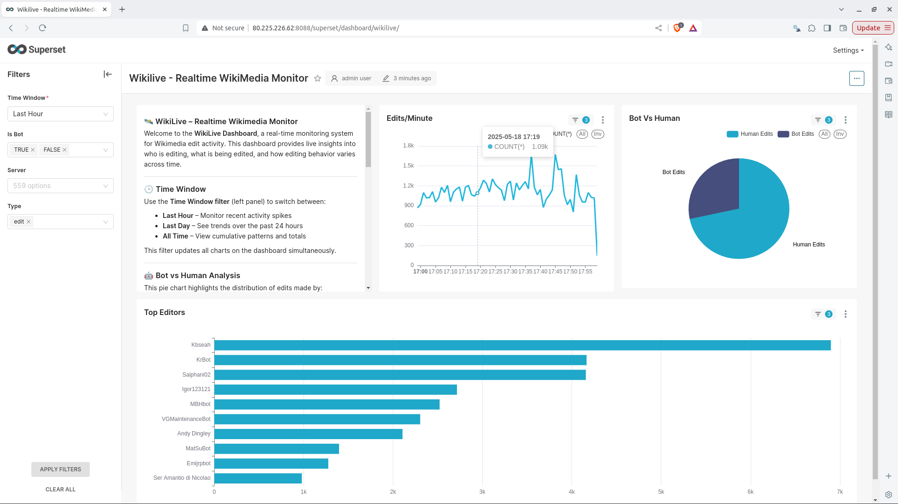

### 🛰️ WikiLive – Realtime Wikimedia Monitor

Welcome to the **WikiLive Dashboard**, a real-time monitoring system for Wikimedia edit activity. This dashboard provides live insights into who is editing, what is being edited, and how editing behavior varies across time.

---

#### 🕒 **Time Window**
Use the **Time Window filter** (left panel) to switch between:
- **Last Hour** – Monitor recent activity spikes  
- **Last Day** – See trends over the past 24 hours  
- **All Time** – View cumulative patterns and totals  

This filter updates all charts on the dashboard simultaneously.

---

#### 🤖 **Bot vs Human Analysis**
This pie chart highlights the distribution of edits made by:
- **Bots** – Automated scripts and services  
- **Humans** – Organic, manual edits by registered or anonymous users  

This helps assess automation vs organic contributions.

---

#### 📈 **Edits Per Minute**
The time series chart shows the **number of edits per minute**, enabling you to:
- Detect bursts of activity  
- Spot peak edit times  
- Monitor latency or lag in real-time updates  

---

#### 🧑‍💻 **Top Editors**
This bar chart showcases the most active editors (human or bot) during the selected time window.

Identify which users or bots are dominating the activity.

---

#### 🔍 **Filters**
You can refine the view further using:
- **Is Bot** – Focus on human or bot edits  
- **Type** – Filter by edit type (e.g., new, minor)  
- **Server** – Narrow down to specific Wikimedia servers  

---

#### 📡 **Auto Refresh**
This dashboard refreshes automatically every **10 seconds**, ensuring live updates without manual refresh.

---

#### 💡 Use Case
This dashboard is ideal for:
- Monitoring real-time Wikipedia activity  
- Detecting bot overuse or malicious edit behavior  
- Understanding editorial trends  

